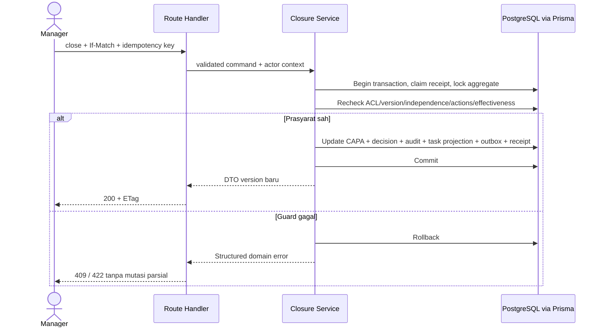

# Kontrak API dan workflow

Kembali ke [indeks desain](../design.md). Kontrak ini menetapkan resource, command, guard dan respons lintas sistem. OpenAPI lengkap serta schema validasi tiap field dibuat pada feature spec sebelum implementasi; daftar berikut bukan API yang sudah berjalan.

## P1. Konvensi HTTP

- Base path `/api/v1`; JSON UTF-8, kecuali upload multipart dan download stream. Session cookie pada origin yang sama. CORS default tidak membuka origin lain.
- `GET` untuk query; `POST /resources` untuk create; `PATCH /resources/:id` hanya field draft yang diizinkan; `POST /resources/:id/actions/:command` untuk transisi. `status`, actor, audit timestamp, dan calculated totals tidak diterima sebagai field editable.
- Update/command existing record wajib `If-Match: "<version>"`; server mengembalikan `ETag`. Create/transition juga wajib `Idempotency-Key`. Bulk measurement update memakai version aggregate inspection revision.
- Filter dan sort di-allowlist. Pagination cursor opaque default 25, maksimal 100, selalu stable tie-break `id`. Cursor terikat filter/sort; input tidak menjadi nama kolom SQL mentah.
- `siteId` dalam request diperlakukan sebagai filter/request scope yang perlu otorisasi, tidak dipercaya sebagai hak akses. Linked IDs divalidasi akses dan same-site.
- Decimal dalam payload berupa string kanonik bertitik (contoh `"10.501"`), tanggal `YYYY-MM-DD`, timestamp ISO UTC. Client mengubah input locale ke format kanonik tanpa floating-point rounding.
- Semua response privat no-store. Data record memakai DTO allowlist dan `allowedActions` untuk UI; command tetap memeriksa izin ulang.

```json
{
  "data": { "id": "uuid", "number": "NCR-S01-2026-000123", "status": "SUBMITTED", "version": 4 },
  "meta": { "correlationId": "uuid", "asOf": "2026-10-09T03:00:00Z" }
}
```

List menambahkan `meta.nextCursor` dan filter diterapkan. Grafik menambahkan numerator/denominator serta ignoredFilters yang relevan. Tidak mengirim total lintas scope sebagai metadata.

```json
{
  "error": {
    "code": "WORKFLOW_GUARD_FAILED",
    "messageKey": "capa.closure.effectivenessRequired",
    "fieldErrors": [],
    "correlationId": "uuid"
  }
}
```

| HTTP | Kode/contoh | Arti |
| --- | --- | --- |
| 400 | INVALID_REQUEST | JSON/header/filter rusak |
| 401 | UNAUTHENTICATED | Session hilang, expired atau akun nonaktif |
| 403 | ACTION_FORBIDDEN / CSRF_REJECTED | Record boleh dibaca, tindakan tidak diizinkan |
| 404 | NOT_FOUND | ID tidak ada atau tidak boleh dibaca; pesan seragam |
| 409 | VERSION_CONFLICT / INVALID_TRANSITION / IDEMPOTENCY_MISMATCH | State/versi/payload tidak sesuai |
| 413 / 415 | FILE_TOO_LARGE / UNSUPPORTED_MEDIA | Batas/jenis file |
| 422 | VALIDATION_FAILED / WORKFLOW_GUARD_FAILED | Field atau prasyarat bisnis belum terpenuhi |
| 428 | PRECONDITION_REQUIRED | If-Match wajib belum dikirim |
| 429 | RATE_LIMITED | Retry-After tersedia |
| 503 | DEPENDENCY_UNAVAILABLE | Kegagalan DB/storage; tidak mengekspos query/secret |

## P2. Katalog endpoint

Untuk resource bernomor: list/detail/create sesuai role, draft PATCH dan command terpisah. Tidak menyediakan DELETE permanen untuk kualitas. Endpoint anak mewarisi parent policy serta transaction boundary.

| Kelompok | Resource/endpoint | Command penting | Requirement |
| --- | --- | --- | --- |
| Session/akses | `/auth/login`, `/auth/logout`, `/me`, `/users`, `/users/:id/access`, `/sites` | activate, deactivate, reset-password, change-access; perubahan locale lewat `/me/preferences` | FR-ACC-001–005, FR-COM-008 |
| Master | `/master/:kind`, `/areas/:id/responsibilities` | deactivate; server allowlist kind per rilis | FR-COM-001, FR-COM-006, FR-COM-010 |
| NCR | `/ncrs`, `/ncrs/:id/submissions`, `/ncrs/:id/costs`, `/ncrs/:id/links` | submit, return, start-review, triage, reject, request-closure, close, reopen, correct, revise-cost | FR-NCR-001–008 |
| CAPA | `/capas`, `/capas/:id/plans`, `/capas/:id/actions`, `/capas/:id/effectiveness` | submit-plan, review-plan, approve-plan, complete-action, evaluate, request-closure, close, reopen | FR-CAPA-001–007 |
| Audit | `/audits`, `/audit-templates`, `/audits/:id/responses`, `/findings` | schedule, start, submit-report, approve-report, return-report, verify-finding, close, reopen-finding, cancel | FR-AUD-001–010 |
| Dokumen | `/documents`, `/document-folders`, `/documents/:id/revisions`, `/document-revisions/:id/content` | submit, review, approve, return, publish, withdraw, obsolete, acknowledge | FR-DOC-001–013 |
| Task | `/tasks`, `/tasks/:id/comments` | assign, start, block, complete, cancel, reopen untuk standalone; sumber untuk workflow | FR-TSK-001–005, FR-ANA-005 |
| Dashboard | `/analytics/summary`, `/analytics/ncr-trend`, `/analytics/pareto`, `/analytics/aging`, `/analytics/costs`, `/analytics/operational` | refresh adalah GET baru, tidak mutation | FR-ANA-001–012 |
| Search/file/log | `/search`, `/attachments`, `/attachments/:id/content`, `/attachments/:id/preview`, `/records/:id/events`, `/notifications` | create export via `/exports`, read notification | FR-COM-002–004, FR-COM-007, FR-COM-009, FR-LOG-001–006 |
| Quality plan | `/quality-plans`, `/plan-revisions`, `/plan-revisions/:id/characteristics`, `/plan-revisions/:id/balloons` | submit, review, approve, publish, withdraw, obsolete, export | FR-QPL-001–006 |
| Inspeksi | `/inspections`, `/inspections/:id/revisions`, `/inspection-revisions/:id/measurements`, `/inspection-revisions/:id/dispositions` | start, submit, return, finalize, amend, set-disposition | FR-INS-001–007 |
| Kalibrasi | `/equipment`, `/equipment/:id/calibrations`, `/calibration-impact-reviews` | submit, verify, return, hold, release, change-interval, retire | FR-CAL-001–006 |
| Maintenance | `/assets`, `/maintenance-schedules`, `/work-orders`, `/work-orders/:id/responses` | assign, start, submit-verification, verify, return, postpone, cancel | FR-MNT-001–005 |
| Supplier | `/suppliers`, `/suppliers/:id/sites`, `/supplier-certificates`, `/supplier-evaluations`, `/supplier-assessments` | verify-certificate, submit-evaluation, approve, return, change-status | FR-SUP-001–006 |
| Training | `/courses`, `/course-revisions`, `/competency-requirements`, `/training-assignments`, `/training-records`, `/training-matrix` | publish, archive, assign, submit-verification, verify, retry, require-retraining | FR-TRN-001–006 |
| Compliance | `/standards`, `/compliance-assessments`, `/clause-assessments`, `/compliance-gaps` | attach-evidence, propose-na, approve-na, submit, approve, return, revise | FR-CMP-001–005 |
| AI | `/ai-analysis-jobs`, `/ai-analysis-jobs/:id`, `/ai-suggestions/:id/reviews` | start, cancel, retry, accept, reject | FR-AI-001–004 |

API modul belum dirilis dinonaktifkan server. Bentuk URI final boleh diperinci tanpa mengubah kontrak bisnis; feature spec wajib menuliskan field, batas ukuran, policy, error dan AC untuk setiap endpoint.

## P3. Contoh command dan transaksi

```http
POST /api/v1/capas/{id}/actions/close
Content-Type: application/json
If-Match: "12"
Idempotency-Key: <opaque-client-key>
X-CSRF-Token: <session-csrf-token>

{"effectivenessCheckId":"uuid","comment":"Bukti efektivitas telah diverifikasi."}
```



Containment darurat tetap pada NCR dan dapat dicatat sebelum CAPA approved. Approval tidak boleh mengubah hasil pengujian agar tampak lulus.

## P4. Transition matrix R1

| Aggregate | Jalur utama dan aktor | Guard/effect |
| --- | --- | --- |
| NCR | Draft → Submitted (author) → Under Review (Supervisor/Manager) → In Progress (triage) → Pending Closure (owner yang ditugaskan) → Closed (Manager independen) | Submit lengkap; triage owner/due/containment/CAPA decision; close evidence + CAPA closed + Critical memiliki CAPA |
| NCR return/reject | Submitted/Under Review → Draft; Under Review → Rejected oleh Supervisor/Manager | Alasan wajib; duplicate menyertakan sumber; Rejected terminal |
| NCR reopen/correction | Closed → In Progress oleh Manager; koreksi submitted oleh Supervisor/Manager | Owner/due baru dan alasan; first_submitted_at tetap; snapshot pengajuan lama utuh |
| CAPA | Draft → Pending Review (penyusun) → Pending Approval (reviewer independen) → In Progress (Manager independen) → Effectiveness Check (owner) → Pending Closure (verifier lulus) → Closed (Manager independen) | Plan version sesuai; action lengkap; verifier tidak pelaksana; bukti mandatory |
| CAPA return/reopen | Review/approval reject atau efektivitas gagal → Draft; closure rejected → Effectiveness Check; Closed → Draft | Alasan dan cycle baru saat reopen; approval lama tidak berlaku pada plan baru |
| Audit | Draft → Scheduled → In Progress oleh Supervisor/Manager; submit report oleh lead → Report Review; approval Manager → Follow-up; close Manager → Closed | Auditor bebas area conflict; checklist snapshot; report approval tidak menutup temuan |
| Finding | Open → In Progress oleh PIC → Pending Verification; Closed oleh verifier independen | Major/minor perlu NCR/CAPA; semua sumber tertutup; reject → In Progress |
| Audit exceptions | Draft/Scheduled → Cancelled; Report Review → In Progress saat return; reopen finding → Follow-up audit | Audit berjalan tidak dihapus; alasan dan audit event |
| Document revision | Draft → In Review (author) → Pending Approval (reviewer) → Approved (Manager) → Effective (Manager/system publisher) → Superseded (publikasi berikutnya) | Payload submitted immutable; approval content hash; effective date terpenuhi |
| Document return/withdraw | In Review/Pending Approval → Draft with new working version; Approved → Withdrawn; Effective → Obsolete | Alasan; Withdrawn tidak boleh auto-publish; revisi lama tetap readable sesuai izin |
| Standalone task | Open → In Progress → Done oleh PIC; Open/In Progress → Blocked → In Progress | Completion evidence/note; active → Cancelled oleh pembuat/Supervisor/Manager; Done/Cancelled → Open dengan due baru |

Jika reviewer dan approver orang yang sama namun independen terhadap author/pelaksana, baseline mengizinkan karena requirement hanya mengharuskan independensi dari author/pelaksana. Dua keputusan tetap terpisah dan dicatat. Pemisahan reviewer versus approver yang lebih ketat perlu perubahan kebijakan eksplisit.

## P5. Transition matrix R2/R3

| Aggregate | Jalur dan command | Guard/effect |
| --- | --- | --- |
| Plan revision | Draft → In Review → Approved → Effective → Superseded | `review` merekam keputusan selama In Review; `approve` hanya sesudah review sah pada hash sama; author tidak reviewer/approver; return → Draft; Withdrawn/Obsolete seperti dokumen |
| Inspection revision | Draft → In Progress → Pending Review → Finalized | Complete expected cells/N/A sah; NCR Fail; independent reviewer; return → In Progress; amend membuat Draft baru dan pointer final lama tetap sampai finalisasi baru |
| Lot disposition | Hold → Accepted under concession / Rework / Rejected | Manager independen, reason/evidence; state hasil Fail dan NCR tidak berubah otomatis |
| Calibration record | Draft → Pending Verification → Verified | Submit Fail membuat equipment hold dalam transaksi yang sama; return → Draft tidak menghapus hold; Verified Pass diperlukan sebelum release independen |
| Equipment | Active ↔ Out of Service, lalu Retired | Release eksplisit sesudah hasil valid; retire tidak menghapus histori; validitas juga memeriksa periode kalibrasi |
| Work order | Open → Assigned → In Progress → Pending Verification → Completed | Checklist dan evidence, verifier independen; return → In Progress; postpone/cancel reason wajib |
| Supplier evaluation | Draft → Pending Approval → Approved; return → Draft | Bobot 100 dan bukti; Manager bukan evaluator; change-status pemasok keputusan tersendiri |
| Course revision | Draft → Published → Archived | Pengelola training; snapshot lengkap; published dipakai assignment |
| Training attempt | Not Started → In Progress → Pending Verification → Qualified / Not Qualified | Verifier independen; retry membuat attempt baru; Expired adalah hasil query terhadap record qualified lewat masa berlaku |
| Compliance assessment | Draft → In Review → Approved; return → Draft | Snapshot clause/bukti; evaluator ≠ Manager approver; N/A perlu decision sebelum dikecualikan; revised assessment tidak menimpa Approved |
| AI job | Queued → Running → Succeeded / Failed / Cancelled | Runtime state terpisah dari status assessment; retry attempt baru, cancel fence mencegah late result dipublikasikan |

## P6. Algoritme lintas modul yang kritis

**Reopen graph.** Link mendukung closure memiliki arah jelas tindakan → sumber. Coordinator mengumpulkan semua CAPA/NCR/finding/audit terkait dalam site yang sama, menolak siklus link yang tak valid, mengunci parent dengan urutan stabil, lalu memeriksa ulang graph/version. Bila graph berubah saat pengambilan lock, ulang seluruh transaksi. Link mutation juga wajib mengambil parent locks yang sama. Reopen hanya sumber yang closed dan bergantung pada tindakan; audit menjadi Follow-up, finding In Progress, NCR In Progress. Semua event berbagi correlation ID. Graph besar tidak boleh dicicil sehingga parsial; batas waktu menghasilkan rollback/conflict untuk dicoba ulang secara terkontrol.

**Publikasi dokumen/plan.** Lock parent → baca Approved revision + hash decision + effective date → tandai current Effective Superseded → aktifkan revision target → audit/outbox/receipt → commit. Scheduler dan manual memanggil service identik. Dua request bersamaan diserialkan; partial unique index menjadi lapisan pengaman. Withdrawn/Obsolete tidak pernah lolos guard.

**Inspeksi dan alat.** Simpan measurement mengunci inspection parent serta equipment yang digunakan, mengecek membership, snapshot unit/batas, kalibrasi yang sudah Verified pada waktu pengukuran dan status hold saat ini. Measurement timestamp masa depan ditolak; input backdate memerlukan alasan dan tidak boleh dipakai untuk mengakali current hold. Bulk save maksimal 3.000 expected cells per revision, atomic; conflict mempertahankan input client. Submit revalidasi seluruh expected pairs. Kalibrasi Fail mengunci equipment yang sama, mencatat hold dan event impact dalam transaksi; worker enumerasi dampak idempoten, tanpa menunda blokir alat.

**Calendar recurrence.** Tentukan occurrence ke-n dari anchor asli dan interval, bukan dari tanggal selesai atau tanggal hasil clamp bulan lalu. Anchor tanggal 31 menghasilkan Februari hari terakhir dan Maret 31. Unique schedule/date mencegah duplikasi retry; cancelled occurrence tetap mengisi slot unik. Perubahan jadwal membuat schedule version baru dan berlaku ke occurrence belum dibuat; order yang sudah ada tidak ditulis ulang.

**Biaya.** Correct entry menghasilkan immutable replacement dengan reason dan reference; sum hanya leaf efektif per chain, bukan original + replacement. Koreksi tidak mengubah original date/currency diam-diam; tanggal replacement eksplisit dipakai pada laporan. Null bukan zero. Angka scrap/rework yang negatif ditolak.

**Readiness dan training.** Readiness hanya assessment versi selected, count Met / applicable; pending N/A tetap applicable. Training memakai requirement level, attempt verified terbaru yang sah dan expiry; status/cell tidak dapat PATCH langsung. Perubahan bukti memicu needs-review marker dan tugas, tidak mengubah approved snapshot.

## P7. Kontrak analitik dan penerapan filter

Query tren/Pareto menggunakan `first_submitted_at` serta exclude Draft/Rejected, tanpa menghitung reopen lagi. NCR terbuka memakai status kini dalam kohort periode; per-site counts memakai populasi tren yang sama. Bulan kosong diisi nol; tie Pareto berdasarkan category code, Uncategorized eksplisit; kumulatif memakai decimal dan no-data tidak menghasilkan garis persentase.

Setiap widget mengirim `populationKey`, `asOf`, `timezone`, `appliedFilters`, `ignoredFilters`, `sourceQuery`. Drill-down dan export menerima filter normalisasi yang sama. My Tasks dan gap training memakai snapshot aktif dan menandai pengecualian periode; kalibrasi/maintenance/sertifikat mengabaikan defect category dengan label. Aging bucket 0–7/8–14/15–30/31–60/>60 memakai hari kalender perusahaan. Numerator unit defect dihitung DISTINCT sample unit setelah join semua failed characteristics. Latest final inspection revision pointer mencegah amendment dihitung ganda.

Analytics worker/read API tidak mengembalikan row terlarang hanya untuk menjelaskan selisih agregat. Jika izin berubah, query berikutnya dibangun ulang. Target initial R1 tanpa cache lintas user; optimasi agregasi berikutnya wajib mempertahankan kesetaraan ACL/detail.
