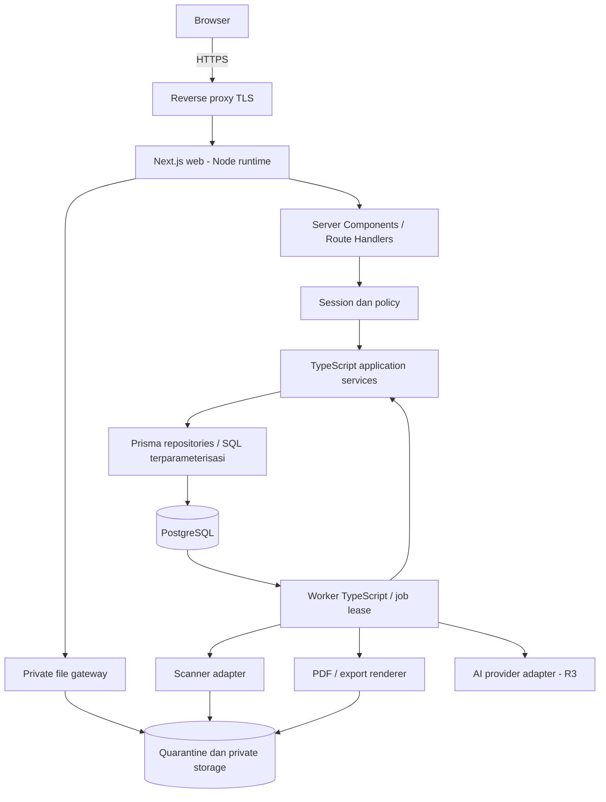

# Arsitektur dan keamanan

Kembali ke [indeks desain](../design.md). Cakupan utama: FR-ACC, FR-LOG, FR-COM, FR-TSK, FR-AI, NFR-SEC, NFR-DAT, NFR-JOB, NFR-AI.

## A1. Topologi dan batas tanggung jawab



| Lapisan | Tanggung jawab | Larangan boundary |
| --- | --- | --- |
| `app` | Routing, initial read, HTTP parsing, status/error, komposisi UI | Tidak memakai Prisma langsung atau memutuskan approval sendiri |
| `modules/*/application` | Use case/command, policy, transaksi, coordinator lintas modul | Tidak bergantung komponen React atau request browser |
| `modules/*/domain` | State machine, invariant, formula murni, tipe bisnis | Tidak mengakses database/file/network |
| `modules/*/infrastructure` | Repository Prisma, SQL scope/query, mapper DTO | Tidak melewati policy scope dari application |
| `shared` | Session, authorization contract, audit, transaction, clock, file, job, idempotency | Tidak menjadi tabel generik pengganti seluruh domain |
| `worker` | Claim job, jalankan handler, retry/lease, rekonsiliasi | Tidak menulis domain table tanpa application service |

Modul: access, master-data, ncr-capa, audits, documents, tasks, analytics, quality-plans, inspections, calibration, maintenance, suppliers, training, compliance, ai-auditor. Setiap modul memiliki public application API. Coordinator workflow boleh mengorkestrasi beberapa modul dengan satu transaction context; tidak membuat transaksi nested terpisah.

## A2. Struktur repository yang akan dibuat

```text
src/
  app/
    [locale]/(auth)/login/page.tsx
    [locale]/(workspace)/layout.tsx
    [locale]/(workspace)/ncr/[id]/page.tsx
    api/v1/.../route.ts
  modules/<module>/
    domain/ application/ infrastructure/ ui/
  shared/
    auth/ policy/ db/ files/ jobs/ audit/ http/ i18n/ clock/
  worker/entry.ts
  messages/id.json en.json ja.json
prisma/
  schema.prisma
  migrations/
tests/
  domain/ integration/ contract/ e2e/ load/ recovery/
docker/
specs/
docs/
```

Ini struktur rencana, bukan daftar file runtime yang sudah ada. TypeScript `strict` aktif. Model database tidak diekspor langsung ke client; gunakan DTO yang hanya membawa field yang boleh dibaca. Dependensi UI/forms/validation/testing dipilih dan dipin pada task fondasi, tanpa mengganti stack wajib.

## A3. Next.js dan batas server/client

Server Components memanggil query application service langsung untuk initial render, tanpa HTTP loopback ke API sendiri. Interaksi browser memakai Route Handlers `/api/v1`. Semua command memakai Node runtime. Client Components dibatasi pada form, tabel interaktif, chart, modal/drawer, balloon editor dan measurement grid; credentials dan Prisma hanya ada di server.

Tidak menggunakan shared static cache untuk record privat atau respons API berizin. Set `Cache-Control: private, no-store` pada API, file, ekspor dan response sensitif; render data privat per request. Memoization hanya sepanjang request. Setelah mutation, invalidasi client query terkait dan refresh server view. Setiap navigation/request memuat ulang session dan policy; shell/layout atau route redirect tidak menjadi satu-satunya penjaga akses. Pola pemisahan ini mengacu pada [Next.js components](https://nextjs.org/docs/app/getting-started/server-and-client-components) dan [authorization guide](https://nextjs.org/docs/app/guides/authentication).

## A4. Session dan authorization

Pilih library auth yang mendukung password login dan server-side revocable session pada spike fondasi; tidak membangun kriptografi/password hashing sendiri. Persyaratan integrasinya tetap ditetapkan sekarang:

- Akun dibuat administrator; tidak ada public signup. Bootstrap Manager melalui perintah deployment satu kali, secret dari operator, wajib ganti password, dan event bootstrap tercatat.
- Cookie session opaque `HttpOnly`, `Secure` pada produksi, `SameSite=Lax`, `Path=/`, tanpa `Domain`; token lookup disimpan aman sesuai adapter library. Jangan menyimpan role/site dalam token sebagai sumber izin final.
- Baseline sesi idle 30 menit dan maksimum 8 jam sebagai konfigurasi awal; rotasi setelah login/perubahan password, revoke saat logout/nonaktif. Timeout ini usulan operasional, ditutup pada feature spec.
- Tiap request memeriksa session, user aktif, role, module grant dan site membership terkini. Cache izin hanya request-local. Job memeriksa ulang hak aktor saat mulai, sebelum commit hasil, dan sebelum hasil diunduh.
- Mutasi cookie-auth memakai validasi origin serta CSRF token; GET tidak mengubah data. Login rate limiting per akun/IP tersimpan bersama di PostgreSQL sehingga berlaku lintas instance; respons tidak membedakan akun tidak ada/password salah.
- Tidak boleh mengubah role/grant/membership sendiri untuk menaikkan hak. Reset password administratif tidak memperlihatkan password lama dan mencabut semua sesi.

`AuthorizationContext` berisi actor ID, role, active sites, grants dan request correlation ID. Policy menerima context + action + metadata entitas + assignment + participant history. Policy menghasilkan `allow/deny` serta query scope, bukan daftar semua data lalu difilter di browser.

| Jenis akses | Pemeriksaan tambahan |
| --- | --- |
| NCR/temuan Inspector | Site + pelapor/assignment sah pada record |
| Dokumen | Site yang berlaku + klasifikasi + izin revisi; draft hanya pihak workflow |
| Training | Peserta sendiri, atau izin training dan cakupan tim/site |
| Approve/review/verify | Role/grant + version + state + bukan author/pelaksana/peserta/lead auditor sesuai modul |
| Attachment/linked record | Hak baca parent dan target; memiliki link tidak menambah hak baca |
| Dashboard/search/export | Terapkan query scope yang sama dengan detail, sebelum agregasi, snippet dan count |

Independensi dievaluasi terhadap riwayat peserta pada revision/cycle, sehingga mengganti owner sebelum approval tidak menghapus konflik kepentingan. Role Inspector yang mengerjakan satu tugas tidak memperoleh izin melihat seluruh register.

Baseline isolasi site di application policy + scoped repository dan composite FK. Database runtime role bukan superuser/owner. PostgreSQL RLS belum menjadi baseline karena policy dokumen multisite dan assignment membutuhkan desain koneksi yang khusus; jika ditambahkan, harus diuji dengan pooling, worker dan migration. Test isolasi tidak ditunda menunggu RLS. Keputusan ini tercatat di [ADR](../adr/README.md).

## A5. Transaksi, concurrency dan audit

Setiap command memakai alur: authenticate → parse/validate → authorize scoped read → transaction → lock/check version → invariant → update domain → decision/audit/task/outbox → commit → response. Policy dan state yang memengaruhi mutasi dicek ulang di dalam transaksi. Transaksi tidak menunggu upload, scan, renderer atau provider AI.

- Aggregate memiliki `version` integer. Update bersyarat `id + version` menaikkan version; zero affected rows menjadi `409 VERSION_CONFLICT`.
- Child mutation yang memengaruhi approval (action item, response checklist, measurement) mengunci parent aggregate yang sama. Approval membaca parent/child pada transaction context yang sama.
- Lock parent digunakan untuk publikasi revisi, closure/reopen graph, kalibrasi/measurement, dan scheduler occurrence. Lock beberapa parent dengan urutan ID konsisten. Read-modify-write kritis memakai SERIALIZABLE atau row-lock protocol yang dibuktikan integration test; retry serialization/deadlock maksimal tiga kali dengan jitter.
- Adapter transaction Prisma memusatkan pilihan API, isolation, timeout, dan normalisasi error SQLSTATE. Detail sintaks menyesuaikan major yang dipin; [dokumentasi Prisma transactions](https://www.prisma.io/docs/orm/fundamentals/transactions) menunjukkan bahwa API/isolation configuration dapat berubah antarversi.
- AuditEvent ditulis sinkron dengan mutasi, bukan hanya melalui worker. Role runtime hanya diberi INSERT/SELECT ke event; revoke UPDATE/DELETE/TRUNCATE dan trigger guard untuk event immutable. Owner/migration tetap privileged dan diawasi operasional.
- ApprovalDecision mereferensikan subject revision, content snapshot hash, cycle, actor dan decision. Approval terhadap versi usang ditolak. Comment alasan wajib untuk reject, reopen, change due date dan koreksi terkontrol.

`Idempotency-Key` wajib pada create/transition/finalize/publish. `CommandReceipt` memiliki unique `(actor_id, command_scope, key)`, request hash, target ID/version dan hasil ringkas. Key sama/payload sama mengembalikan hasil sebelumnya setelah otorisasi ulang; payload berbeda ditolak 409. Receipt dan efek bisnis commit bersama. Replay tidak mengembalikan data yang izinnya sudah dicabut. Simpan receipt command penting tanpa expiry otomatis sampai kebijakan retensi ada; hapus transaksi gagal agar retry sah dapat berlangsung.

## A6. Jobs, tasks dan notifikasi

OutboxEvent dibuat bersama mutasi, lalu worker mengubahnya menjadi job/notifikasi. PostgreSQL-backed queue baseline menghindari kebutuhan Redis pada R1. Claim batch menggunakan row lock `FOR UPDATE SKIP LOCKED`, `lease_until`, `attempt`, `next_attempt_at`, dan fencing token. Worker heartbeat memperpanjang lease; commit hasil hanya sah bila fencing token masih cocok. Job yang kehabisan lease dapat diambil worker lain. Retry dibatasi; setelah batas masuk Failed dan dapat dijalankan ulang operator berizin dengan audit.

Scheduler memindai item due tiap menit. Notification unique key `(source_id, cycle, recipient, event_type, threshold)`; work order unique `(schedule_id, occurrence_date)`. Reminder 30/7/1 hari dan overdue memakai tanggal perusahaan. Setelah downtime, proses threshold terbaru yang terlewat, bukan mengirim semua reminder lama sekaligus; dedupe tetap berlaku. PUB/doc dan plan memakai service publikasi yang sama dengan aksi manual, termasuk status Withdrawn dan tanggal efektif.

Task standalone adalah entity mutable. Task workflow adalah projection transactional dari assignment aktif dengan unique `(source_id, cycle, action_type, assignee_id)`; title/status/action berasal dari sumber. List tasks selalu join policy sumber. Eventual notification diperbolehkan, tetapi status sumber dan proyeksi task inti harus konsisten setelah commit.

Job ekspor/AI menyimpan actor, scope, input revision dan permission fingerprint. Jika permission fingerprint berubah ketika berjalan, hentikan/restart setelah otorisasi ulang; tidak terus memproses dengan snapshot izin lama. Download hasil tetap memeriksa izin terkini.

## A7. Lampiran, preview dan ekspor

1. Upload gateway menerima multipart streaming maksimum 10 MB per file, memeriksa declared size dan byte count, tipe MIME/signature serta filename aman. Parent scope diverifikasi sebelum upload.
2. Simpan object acak immutable ke quarantine di luar public/static directory; hash SHA-256, metadata `PendingScan`, dan outbox scan dicatat. Tidak percaya ekstensi file atau path dari client.
3. Worker scanner memeriksa file; Clean dapat direferensikan untuk review, Rejected tidak dapat dibaca pengguna biasa. Scanner down menghasilkan Retry/PendingScan, bukan fail-open.
4. Preview/thumbnail diturunkan hanya dari Clean source oleh renderer terisolasi dengan timeout/resource cap, tanpa network fetch aktif. Derived file mewarisi parent ACL.
5. Gateway memeriksa izin dan status setiap request, termasuk range request PDF. Stream object melalui aplikasi dengan header tipe/disposition yang aman, `nosniff`, no-store; bucket/path asli tidak dipaparkan. Unduhan/ekspor memiliki access event; kegagalan audit akses membuat request gagal sebelum stream dimulai.

Baseline storage: volume privat durable untuk satu host, adapter memungkinkan S3-compatible private object store saat scale-out. Jangan menaruh file dalam ephemeral container layer. Metadata DB dan object store tidak atomic: file selesai ditulis dahulu, baru metadata/link commit; kegagalan meninggalkan object quarantine orphan yang direkonsiliasi. Cleanup hanya orphan/unsubmitted temporary file dengan grace period dan log; bukti kualitas tertaut tidak dihapus. Backup selalu merekonsiliasi DB manifest dan checksum object.

CSV menetralkan formula injection pada sel teks yang diawali `=`, `+`, `-`, `@` tanpa merusak nilai numerik terstruktur. Ekspor besar dijalankan worker dari filtered snapshot dan dipartisi per scope; file hasil tidak mengizinkan data yang lebih luas dari sumber. PDF menampilkan nomor/revisi/status, filter, timezone dan timestamp; draft diberi watermark.

## A8. Analitik dan AI

Analitik memakai scoped query PostgreSQL untuk R1; indeks dan query plan diperiksa sebelum menambah materialized view. Satu `FilterContext` memuat site, periode, kategori, timezone dan definisi populasi. Response memuat `asOf`, `appliedFilters`, `ignoredFilters`, numerator/denominator dan tautan drill-down. Dashboard polling 60 detik selama tab aktif, refresh setelah mutation, label stale ketika gagal; tidak menjanjikan event streaming.

AI R3 memakai `AIProvider` adapter. Job mengambil hanya evidence versi tertentu yang lolos ACL; dokumen diberi label data tidak tepercaya. Model tidak menerima credentials, database connection, atau tool untuk mutasi. Output harus lolos schema validation (clause ID, evidence ID/location, suggestion, insufficient-evidence flag). Citation diverifikasi terhadap manifest input; source di luar manifest ditolak. Biaya/token/time budget dibatasi; timeout dapat direkonsiliasi dengan provider request ID sebelum retry untuk menghindari biaya ganda. User menerima/menolak suggestion; service terotorisasi membuat draft, lalu workflow manusia normal berlaku.

Audit AI merekam versi model/template dan hash/input references; log teknis tidak menyalin seluruh bukti. Hasil serta manifest tersimpan privat. Bila sumber berubah atau akses dicabut, hasil ditandai stale/unavailable sesuai scope dan tidak dianggap penilaian final. Readiness tetap dihitung deterministik dari ClauseAssessment manusia.
