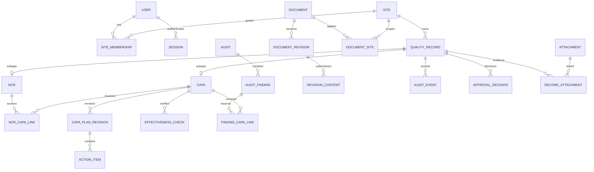
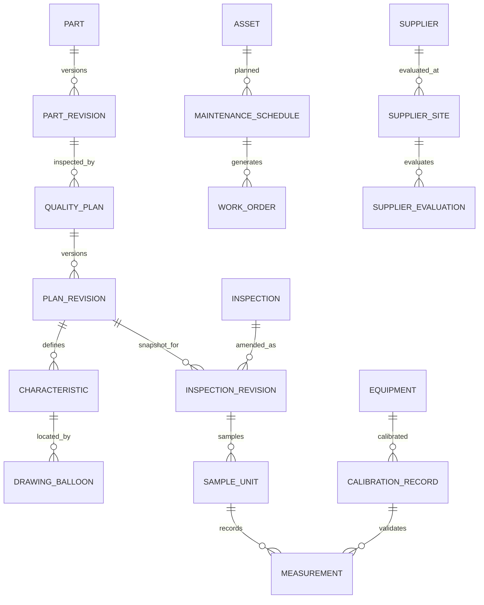

# Model data dan integritas

Kembali ke [indeks desain](../design.md). Nama entitas di bawah menjadi kontrak logis untuk Prisma; ini bukan `schema.prisma` yang sudah divalidasi. SQL dan mapping Prisma persis dikunci pada fondasi. Relasi eksplisit diprioritaskan dibanding pasangan bebas `entity_type/entity_id`.

## D1. Konvensi penyimpanan

| Data | Tipe/desain |
| --- | --- |
| Primary key | UUID, opaque dan stabil; nomor bisnis adalah unique terpisah |
| Timestamp | PostgreSQL `timestamptz`, UTC; API ISO 8601 dengan `Z` |
| Due/effective/expiry date | PostgreSQL `date`; interpretasi pada timezone perusahaan, default Asia/Jakarta |
| Jumlah unit | Integer nonnegatif; sample count positif; inspected/defect nullable bila tidak relevan |
| Ukuran/toleransi | `numeric(24,9)` sebagai baseline; over-precision ditolak, tidak dibulatkan diam-diam saat simpan |
| Biaya | `numeric(20,2)` + kode mata uang; nilai kosong tetap null |
| Bobot/skor | `numeric(7,4)` bobot, skor integer 1–5; kalkulasi desimal, pembulatan hanya tampilan |
| Concurrency | `version integer >= 1`, increment pada setiap mutasi aggregate |
| Status | Enum/code stabil bahasa Inggris; transisi hanya application service; UI menerjemahkan label |
| Snapshot | JSONB schema-versioned untuk payload bukti/form frozen; bukan pengganti FK, state atau nilai yang perlu constraint |
| Immutable version | `revision_no`, `working_version`, `cycle`, `content_hash`, submitted/approved/effective timestamps |

Due date berakhir pada awal hari berikutnya di timezone perusahaan; overdue diuji `now >= nextLocalMidnight`, setara aturan akhir hari tanpa masalah presisi subdetik. Perubahan timezone/mata uang perusahaan setelah ada transaksi memerlukan prosedur administratif khusus; tidak diam-diam menafsir ulang histori. Locale pengguna tidak mengubah timezone.

## D2. ERD inti



`QualityRecord` adalah registry metadata minimal (ID, kind, site scope, business number), bukan generic payload untuk semua modul. Domain table memakai PK=FK ke registry dan constraint kind yang cocok. Registry multisite document memiliki `site_id = null` dan akses melalui DocumentSite; single-site domain wajib site. Gunakan composite `(record_id, kind, site_id)`/kind checks sesuai subtype. Tidak boleh membuat registry tanpa domain row yang cocok pada akhir transaksi; enforce dengan deferred constraint trigger atau model registry khusus per modul saat spike SQL, disertai integration test. Master data global tidak wajib QualityRecord.

Registry memungkinkan AuditEvent, TaskProjection, AttachmentLink dan ApprovalSubject mempunyai FK nyata. Link bisnis yang menentukan closure tetap tabel bertipe (NcrCapaLink, FindingCapaLink, FindingNcrLink) agar cardinality dan same-site dapat ditegakkan. ApprovalDecision menautkan `ApprovalSubject` immutable yang memiliki FK registry, revision/cycle, hash dan snapshot; subject diterbitkan domain service yang memiliki versinya.

## D3. R1 — kamus entitas

Semua entitas mutable memiliki `created_at/by`, `updated_at/by`, `version`; entitas append-only hanya waktu/aktor pencipta. Kolom di tabel adalah tambahan minimum yang perlu dimodelkan.

| Entitas | Kolom dan relasi minimum | Constraint/indeks utama |
| --- | --- | --- |
| CompanySettings | timezone, locale default, currency, numbering policy | Satu perusahaan; perubahan beralasan |
| User, Session | normalized email, display name, role, active, auth version, locale; session expiry/revoked | Unique email; session token lookup unik; indeks expiry |
| SiteMembership, ModuleGrant | user/site; user/module/action/site | Unique kombinasi; FK User/Site |
| Site, ProcessArea, AreaResponsibility | code/name/active; area/site; user/area berlaku | Unique code/site; auditor tidak boleh area responsibility sendiri |
| DefectCategory, MasterValue | code, label, active, kind | Unique kind/code; deactivation menggantikan delete |
| QualityRecord | kind, site_id, business_no, discarded_at | Unique nomor bisnis; FK scope; indeks kind/site |
| Ncr | record_id, reporter, status, title, description, occurred_at, first_submitted_at, category, severity, area, owner, due_date, inspected_qty, defect_qty | Check jumlah; `(site_id,status,due_date,id)`, `(site_id,first_submitted_at,id)`, reporter/owner indexes |
| NcrSubmission, NcrCorrection | ncr, sequence, payload snapshot/hash, reason, actor | Unique ncr/sequence; immutable; first_submitted_at write-once |
| Capa, CapaPlanRevision | source kind, status, cycle, owner, due_date; root cause/method, preventive risk, plan snapshot | Unique capa/revision; critical fields frozen setelah submit |
| ActionItem, EffectivenessCheck | plan revision, PIC, due/status/evidence; capa cycle, independent verifier, criteria/evaluation time/result | FK plan/cycle; parent lock saat update; evidence required sebelum complete |
| NcrCapaLink, FindingCapaLink, FindingNcrLink | source/target ID, site, supports_closure, link reason | Composite FK sama site; unique pair; penghapusan link submitted dilarang, koreksi berversi |
| Audit, AuditAssignment | record, scope, area, schedule, type, lead, status; assigned user/role | Indeks site/status/date; unique audit/user/role |
| ChecklistTemplate, TemplateVersion, ChecklistSnapshot | versioned questions; frozen copy ketika audit start | Unique template/version; snapshot immutable |
| ChecklistResponse, AuditFinding | snapshot question/answer/note; classification, evidence, owner, due,status | Unique audit/question; temuan memiliki registry sendiri |
| DocumentFolder, Document, DocumentSite | parent folder; global number/type/owner/classification; document/site | Folder cycle ditolak; unique doc/site; folder tidak menambah ACL |
| DocumentRevision, RevisionContent | revision number/state/effective date/review date; working version/file/metadata snapshot/hash | Unique doc/revision; unique revision/working_version; effective partial unique index |
| ApprovalSubject, ApprovalDecision | record, revision/cycle, content hash/snapshot; stage, decision, actor, comment | Unique decision per subject/stage/decision slot; tidak menimpa penolakan sebelumnya |
| DocumentAcknowledgment | user, revision content, read_at | Unique user/content; revisi baru memerlukan acknowledgment baru |
| QualityCostEntry, CostCorrection | ncr, kind, amount/currency/date, evidence; replaces entry/reason | Amount ≥0; satu replacement aktif per entri; sum hanya effective chain leaves |
| StandaloneTask, TaskProjection, TaskComment | record/PIC/status/priority/due; source/cycle/action/assignee; text/evidence | Unique source/cycle/action/assignee; task workflow tidak dapat diedit manual |
| Attachment, RecordAttachment, FileDerivative | storage key, hash, detected MIME, size, scan state; parent/revision link; source/hash/type | Unique storage key; size limit; FK parent/source; Clean wajib untuk publish |
| AuditEvent | record, actor/system actor, UTC, action, before/after allowlist, reason, correlation | Indeks record/time dan actor/time; append-only permissions |
| Notification | recipient, source/cycle/type/threshold, read_at | Unique dedupe key; source ACL saat list/detail |
| CommandReceipt, OutboxEvent, Job | scope/key/hash/result; payload/ref; state/lease/fence/attempt/next retry | Unique receipt key dan job dedupe; pending/due partial indexes |
| ExportJob, BusinessNumberAllocation | scope/filters/revision manifest/file; type/site/year/sequence/status | Export private; nomor allocated tidak dipakai ulang |

User password/account/session fields akhir mengikuti auth adapter terpilih. Domain policy tidak bergantung nama tabel library. Tidak menyimpan credential dalam AuditEvent.

## D4. R2 — data operasional



| Entitas | Kolom/relasi minimum | Aturan data |
| --- | --- | --- |
| Part, PartRevision, UnitOfMeasure | code, title, revision, unit dimension/code | Unit stabil; conversion baseline tidak otomatis |
| QualityPlan, PlanRevision | site, part revision, type, author; state, effective date, drawing content ID/hash | Unique plan/revision; satu Effective per plan; approval subject hash |
| Characteristic, DrawingBalloon | snapshot revision, number, kind, nominal/LSL/USL/unit, required, allow_na, sample_count, method/gage_type; page/x/y | Unique revision/number; sample >0; x/y dalam [0,1], page valid; numeric bounds valid |
| Inspection, InspectionRevision | registry/site/type/lot/part/PO/WO/supplier, assigned PIC; plan snapshot/hash, state, revision, finalized_at | Satu current final revision pointer, draft amendment terpisah; pointer FK harus milik inspection sama |
| SampleUnit, SampleCharacteristicRequirement | revision, stable sample ID; expected characteristic/sample pairs | Unique revision/sample code; expected pairs dibekukan sehingga missing cell terdeteksi |
| Measurement | revision/sample/characteristic, decimal atau attribute result, note, measured_at, equipment/calibration, result | Unique revision/sample/characteristic; composite FK ke snapshot yang sama; null ≠ zero; typed value check |
| LotDisposition, InspectionNcrLink | inspection revision, decision/reason/actor/evidence; NCR link | Fail tetap historis; same-site; hanya Manager independen |
| MeasuringEquipment, EquipmentStatusEvent | site, serial/type/range/resolution/unit/owner, operational status; hold/release event/time | Unique site/equipment code; status interval historis; lock parent untuk penggunaan dan hold |
| CalibrationRecord, CalibrationPoint | equipment, performed_at, actor/lab, state/result, verified_at, valid_until, standard/evidence; measured point/limit/value | Pass Verified + waktu valid; due > performed date; record approved immutable |
| CalibrationImpactReview, ImpactedInspection | failed calibration, interval start/end, PIC/status; inspection reference/decision/NCR | Unique failure/inspection; snapshot daftar dapat diperluas lewat event tambahan |
| Asset, EquipmentAssetLink | site/location/status/owner; equipment/asset | Explicit one-to-one bila objek sama; status kalibrasi tidak mengikuti maintenance otomatis |
| MaintenanceSchedule, ScheduleVersion | asset, anchor date, recurrence kind/interval, active; frozen checklist/PIC | Month anchor disimpan asli; occurrence dihitung dari anchor bukan hasil clamp sebelumnya |
| WorkOrder, WorkOrderResponse | schedule/version/occurrence/due/PIC/state/time/downtime; checklist answer/evidence | Unique schedule/occurrence; respons wajib sebelum verify; next schedule tetap |
| Supplier, SupplierSite | global identity/contact; site/owner/status | Unique supplier/site; akses global identity hanya jika ada SupplierSite berizin |
| SupplierCertificate | supplier site, type/number/issuer/date/expiry/verified/file | State verification terpisah dari expiry derived |
| SupplierEvaluation, EvaluationScore | supplier site, period, state, evaluator, criteria snapshot/next review; score/weight/evidence | Score 1–5, weight ≥0; total 100 divalidasi transaction parent |
| SupplierAssessment, AssessmentResponse | supplier site/template snapshot, external respondent/internal recorder; answers/evidence | Kedua identitas terpisah; tanpa akun portal tersirat |

Expected sample pairs menangani jumlah sampel berbeda per karakteristik. Unit eligible denominator hanya bila semua karakteristik wajib yang applicable untuk unit tersebut selesai; N/A yang sah bukan Fail. Pengukuran yang tidak diharapkan ditolak. Defect rate memakai unit unik dari current final revision per inspection, tanpa menggandakan amendment.

## D5. R3 — data kompetensi dan compliance

| Entitas | Kolom/relasi minimum | Aturan data |
| --- | --- | --- |
| JobPosition, Competency, PositionRequirement | site/person/job; competency level/code; required level, valid period | Kewajiban berversi; tidak menghapus penugasan lama |
| Course, CourseRevision | code/state; criteria, materials, delivery, trainer, validity, competency level | Published snapshot immutable; Archived tidak membuat assignment baru |
| TrainingAssignment, TrainingAttempt, TrainingRecord | user/course revision/requirement snapshot/due; progress/evidence/score; verifier/result/level/expiry | Tidak self-verify; percobaan gagal tetap ada; satu penugasan per sumber/cycle |
| RetrainingDecision | source revision change, impacted population, reason, new course revision/due | Explicit outcome required sebelum membuat assignment baru |
| StandardVersion, Clause | standard/code/edition/license source; parent/code/text | Unique standard/version dan clause/code; konten sesuai hak penggunaan |
| ComplianceAssessment, ClauseAssessment | site/standard version/scope/period/version/state; frozen clause/status/evaluator/reason | Unique assessment/clause; N/A approval terpisah; Met evidence required |
| EvidenceLink | assessment/clause, source registry + immutable revision/hash/location | FK source registry; version manifest immutable; status sumber berubah → needs review |
| ComplianceGap | clause assessment, owner/due/task, optional NCR/CAPA | Same-site dan policy pada kedua ujung relasi |
| AIAnalysisJob, AIEvidenceManifest | actor/scope/model/template/budget/state/provider request ID; versions/hash/ACL fingerprint | Tidak menyimpan secret/provider token; immutable input manifest |
| AISuggestion, AIReviewDecision | job/clause/text/citations/insufficient evidence; actor/accept/reject/reason/draft target | Citation harus termasuk manifest; accepted tidak berarti assessment approved |

Training matrix dan readiness adalah query/projection, bukan field bebas yang dapat diedit. Qualified dipadukan dengan required level dan expiry untuk menentukan gap. Snapshot Approved tidak ditulis ulang saat dokumen berubah; tambahkan event kebutuhan review dan versi assessment berikutnya.

## D6. Constraint, locking, dan indeks SQL

Contoh DDL berikut adalah kontrak constraint, bukan migration yang sudah dijalankan:

```sql
CREATE UNIQUE INDEX document_one_effective
  ON document_revision (document_id) WHERE status = 'EFFECTIVE';
CREATE UNIQUE INDEX plan_one_effective
  ON plan_revision (quality_plan_id) WHERE status = 'EFFECTIVE';
ALTER TABLE work_order ADD CONSTRAINT work_order_occurrence_unique
  UNIQUE (schedule_id, occurrence_date);
ALTER TABLE measurement ADD CONSTRAINT measurement_cell_unique
  UNIQUE (inspection_revision_id, sample_unit_id, characteristic_id);
```

Partial unique index menjamin **maksimal satu** revisi Effective. Service publikasi dengan parent lock memastikan setelah aktivasi yang sah ada satu; dokumen belum terbit/Obsolete boleh nol sesuai requirements. FK komposit memastikan pointer current revision milik parent yang sama. Check constraints menangani tipe/range lokal; aturan lintas row seperti bobot 100%, kompetensi, reviewer independen, serta closure graph diperiksa service dalam transaksi dengan parent lock. [PostgreSQL partial indexes](https://www.postgresql.org/docs/current/indexes-partial.html) dan [row locking](https://www.postgresql.org/docs/current/explicit-locking.html) menjadi dasar mekanisme ini.

Indeks tambahan: `(site_id, status, due_date, id)` pada record operasional; `(assignee_id,status,due_date,id)` pada task; `(document_id,revision_no)`; `(equipment_id,performed_at)` dan measurement `(equipment_id,measured_at)` untuk impact review; `(recipient_id,read_at,created_at)` untuk notifikasi; `(state,next_attempt_at,lease_until)` pada job. Tambah indeks hanya dari query plan terukur. Untuk pencarian nomor/judul gunakan normalisasi Unicode, exact/prefix dan substring terparameterisasi; kebutuhan Jepang tidak mengandalkan English stemming. Evaluasi trigram index pada corpus nyata sebelum aktivasi extension.

## D7. Snapshot, nomor, migrasi dan retensi

- Working draft dapat berubah dengan version guard. Submit membuat content snapshot/hash immutable. Returned merevisi working version baru dalam business revision yang sama; keputusan lama menunjuk snapshot lama. Approved/Effective payload tidak ditimpa.
- Number allocation memakai database sequence/counter yang dialokasikan dan dicatat terpisah sebagai Reserved sebelum transaksi create; bila create gagal nomor ditandai Void, tidak didaur ulang. Key idempotensi menghubungkan reservation ke command agar retry tidak membuat nomor baru. Gap sah dan terdokumentasi.
- Restrict delete pada kualitas/audit/approval/link historis; logis discard untuk draft. User/master nonaktif tetap dapat menjadi FK historis.
- Prisma migrations tersimpan di version control. Generate draft migration, review SQL, tambah constraint/trigger/index khusus secara eksplisit, lalu uji clean database dan upgrade fixture. Jangan mengandalkan schema diff untuk mempertahankan custom SQL tanpa verifikasi katalog DB.
- Produksi hanya menjalankan migration apply/deploy noninteraktif sesuai versi Prisma terpilih, bukan development reset atau schema push. Expansion dilakukan sebelum code switch; contraction setelah data/backfill diverifikasi dan versi lama tidak lagi berjalan. Referensi: [Prisma migration editing](https://www.prisma.io/docs/orm/migrations/editing-a-migration) dan [deployment](https://www.prisma.io/docs/orm/migrations/applying-a-migration).
- R1 membuat tabel fondasi/core saja; R2/R3 menambahkan tabel sesuai dependensi. Backfill menjalankan batch idempoten dengan checkpoint/audit operasional, bukan transaksi panjang yang memblokir pengguna.
