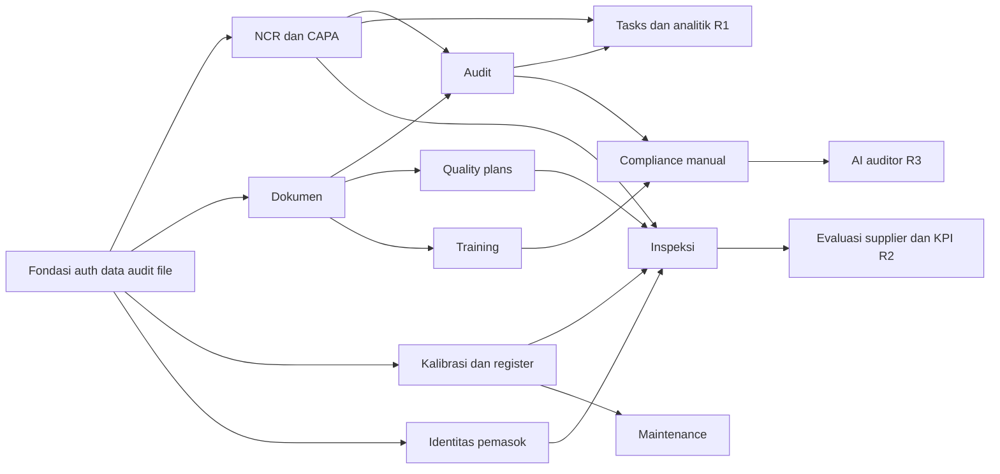

# PLAN-001 — Rencana desain dan implementasi

Sumber: [spec](spec.md), [requirements](../../docs/requirements.md), [indeks desain](../../docs/design.md). Stack tetap Next.js + TypeScript + PostgreSQL + Prisma + Docker.

## 1. Pemetaan spesifikasi ke komponen

| Spec | Komponen utama | Desain |
| --- | --- | --- |
| S1 | Session service, AuthorizationContext, policy module, DTO, localization | [Arsitektur](../../docs/design/architecture.md), [UI](../../docs/design/ui-ux.md) |
| S2 | NCR/CAPA, audit, document, task domain services dan transaction boundary | [Data](../../docs/design/data-model.md), [API/workflow](../../docs/design/api-workflows.md) |
| S3 | Plan snapshot, measurement evaluation, equipment lock, schedule, supplier evaluation | [Data](../../docs/design/data-model.md), [API/workflow](../../docs/design/api-workflows.md) |
| S4 | Competency projection, clause assessment, AI provider adapter dan review | [Arsitektur](../../docs/design/architecture.md), [API/workflow](../../docs/design/api-workflows.md) |
| S5 | Query scopes, analytics, audit event, attachment, idempotency/outbox | [Arsitektur](../../docs/design/architecture.md), [Data](../../docs/design/data-model.md) |
| S6–S7 | Contract tests, fault injection, concurrency/load, Docker health, backup/restore | [Operasi/uji](../../docs/design/operations-testing.md), [traceability](../../docs/design/traceability.md) |

## 2. Urutan dependensi

Assignment/task primitives dibangun pada fondasi, meskipun layar gabungan dan analitik diselesaikan di akhir R1. Identitas pemasok minimal hadir sebelum inspeksi incoming; evaluasi lengkap dapat menyusul. Dokumen tersedia sebelum audit memakai revisi dokumen sebagai bukti. Ini memperinci urutan requirements tanpa mengubah cakupan rilis.

## 3. Strategi implementasi

1. Tutup spike kompatibilitas Node/Next/Prisma/PostgreSQL, library auth dan Docker; buat lockfile serta catatan versi.
2. Bentuk satu vertical slice login → authorized read → command → transaction/audit → UI conflict sebelum memperbanyak modul.
3. Tulis feature spec dan acceptance tests modul pertama, kemudian model/migration, service, Route Handler, UI, worker integration, dan pengujian.
4. Gunakan kontrak domain yang sama dari web/worker; jangan membuat workflow kedua dalam cron/script/admin UI.
5. Setiap feature PR menyertakan ID requirement, perubahan desain, migration SQL, bukti test dan penanganan rollback.
6. Aktifkan modul melalui release configuration server setelah schema, policy, jobs, UI dan test siap; UI tersembunyi bukan kontrol akses.

## 4. Batas readiness

Desain lintas sistem ini selesai pada tingkat kontrak arsitektur, data, API dan UI. Feature spec mendetail wajib menutup field validation, payload setiap command, pemetaan SQL Prisma versi terpilih, dan fixture sebelum coding fitur tersebut. Tidak ada deployment atau persetujuan keputusan bisnis yang tersirat oleh dokumen ini.

Gate terbuka mengikuti bagian 4 [indeks desain](../../docs/design.md). R1 tidak menunggu provider AI. R2 operasional menunggu kebijakan alat, presisi dan lot; R3 AI menunggu kebijakan data/provider. Detail regulasi tetap keputusan bisnis, bukan asumsi teknis.

## 5. Deliverables dan bukti

Desain selesai bila semua FR/NFR terpetakan, 43 AC memiliki test intent, state/izin lintas modul konsisten, relasi data enforceable, dan jalur gagal dijelaskan. Implementasi selesai hanya setelah tests yang direncanakan benar-benar dijalankan serta memenuhi [exit gate](../../docs/design/operations-testing.md). [Tasks](tasks.md) tetap unchecked sampai bukti implementasi ada.
